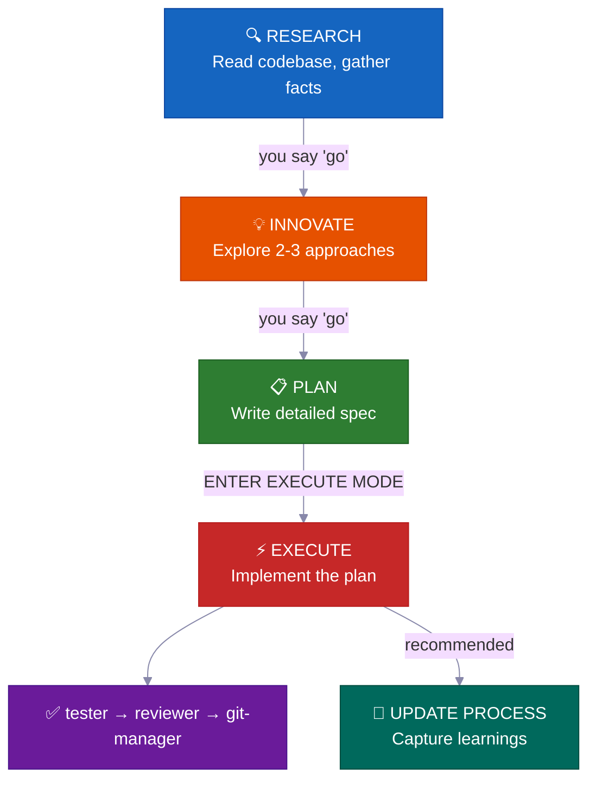
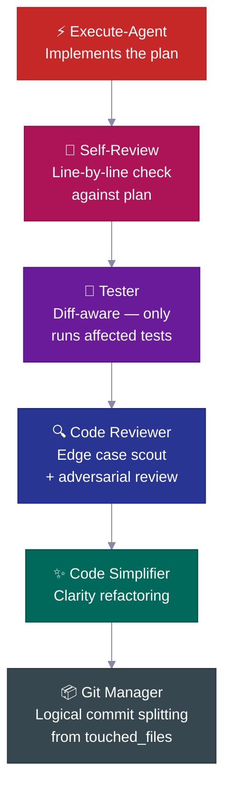
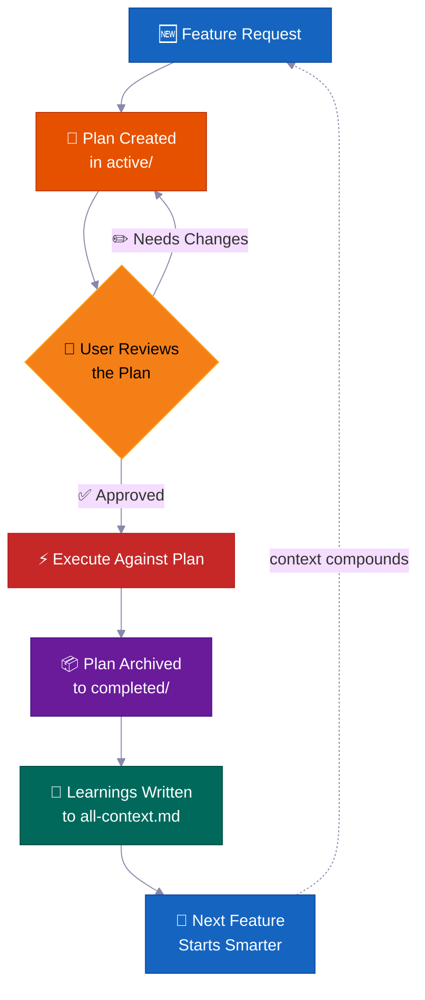
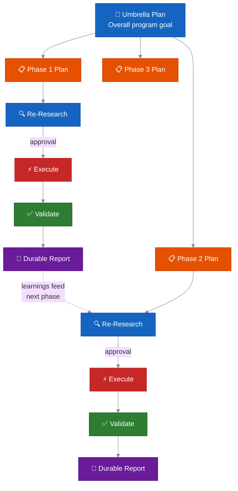

<div align="center">

<a href="https://flowser.ai">
  
</a>

*Sponsored by [Flowser.ai](https://flowser.ai) — AI Agents with computers for GTM*

<br>

# vibecode-pro-max-kit

**Your AI coding agent writes code before it understands your project.<br>This fixes that.**

Stop your agent from jumping straight to implementation. This harness forces a structured workflow — research first, plan second, execute third — with explicit approval at every transition. No more rewriting AI-generated code because it missed the point.

<p>
  
  
  
  
  
</p>

</div>

---

## 🔥 The Problem

You ask Claude to "add webhook support." It immediately starts writing code. No questions about your architecture. No check on existing patterns. No plan. You get 400 lines that don't fit your codebase, and you spend an hour fixing it.

**This happens because your agent has no workflow.** It has intelligence but no process.

---

## 🛠️ The Fix

This harness installs a complete development system into your project — not just a CLAUDE.md file, but 12 specialized agents, 31 skills, and a phase-locked workflow that forces your agent to **understand before it builds**.



Every transition requires your **explicit approval**. Nothing auto-advances. You stay in control.

---

## 🚀 Install (30 seconds)

```bash
curl -fsSL https://raw.githubusercontent.com/withkynam/vibecode-pro-max-kit/main/install.sh | bash
```

Then open Claude Code and say:

```
Run vc-setup
```

That's it. The setup skill detects your stack, asks you about your project (a real conversation, not a checklist), scaffolds the process directory, deep-scans your codebase, and populates context files with actual content — not placeholders.

<details>
<summary><strong>📦 What happens during install</strong></summary>

- **Fresh project?** Installs the full harness, then `vc-setup` studies your codebase
- **Existing `.claude/` config?** Backs up to `.vibecode-backup/`, installs fresh, restores your `settings.json`
- **Existing `process/` directory?** Never touched by install — `vc-setup` handles migration intelligently
- **Existing `CLAUDE.md`?** Backed up as `CLAUDE.md.pre-vibecode`, harness version installed

</details>

<details>
<summary><strong>🤖 Full agent setup prompt</strong> (copy-paste this into Claude Code for maximum control)</summary>

```
First, install the vibecode-pro-max-kit agent harness by running this command:

curl -fsSL https://raw.githubusercontent.com/withkynam/vibecode-pro-max-kit/main/install.sh | bash

After the install completes, run vc-setup to configure everything for this project.

Follow the full interactive flow:

1. DETECT — Read package.json, detect my stack (framework, package manager, monorepo
   structure, test framework, database, auth). Also check if I have any existing .claude/,
   process/, or context files from a previous setup.

2. SHOW ME WHAT YOU FOUND — Present a summary of the detection results and wait for me
   to confirm before continuing. If this is an existing project with process/ folders or
   context files, tell me what you found and what looks good vs what could be improved.

3. ASK ME ABOUT THE PROJECT — Before scaffolding or scanning, have a real conversation
   with me about this project. Don't just ask a fixed list of questions and move on — ask
   follow-ups based on my answers, probe deeper on anything vague, and keep going until
   you genuinely understand the project. Start with the basics (what is this? who uses it?),
   then dig into architecture, features, conventions, pain points, and anything else that
   matters. Summarize your understanding back to me and confirm it's correct before moving on.

4. SCAFFOLD — Create the process/ directory structure. If I already have process/ folders,
   show me what you plan to change and wait for my approval before reorganizing anything.
   Never silently move or delete my existing files.

5. STUDY — Deep-scan the codebase and populate process/context/all-context.md with REAL
   content based on what you find AND what I told you. Include: repo structure, tech stack
   with versions, key patterns and conventions, import aliases, env vars, API routes,
   database schema, test setup. Do not leave placeholder text.

6. VALIDATE — Run all the validation checks to make sure everything is wired correctly.

Important rules:
- If I have existing context files or a well-written CLAUDE.md, read them first and
  preserve what is good. Merge intelligently — do not replace good content with generic scans.
- Show me a summary of what you plan to create or change at each major step and wait
  for my OK before proceeding.
- Do not create empty placeholder files. Only create files that have real content.
- Ask before reorganizing. If my existing setup works, tell me what you would improve
  and let me decide.
```

</details>

---

## ⚡ What Makes This Different

Most agent harnesses give you a big CLAUDE.md and some instructions. Here's what this one actually does:

### 🔒 Phase-Locked Tool Restrictions
Your agent literally **cannot** write code during research. Each phase has tool restrictions enforced at the agent level — RESEARCH is read-only, INNOVATE has no Bash access at all, PLAN can only write to `process/` directories. Not instructions that can be ignored — actual capability removal.

### 🎯 Smart Auto-Routing with Intent Detection
The system detects your intent from natural language ("build", "fix", "debug", "refactor") and routes to the correct pipeline automatically. A 6-level precedence order resolves conflicts when multiple intents match. One clarifying question max — never a 20-questions interrogation.

### 🔍 Automatic Skill Discovery (Step 0)
Before routing any request, the orchestrator scans 31 skills and matches keywords. Say "add webhook support" and it automatically surfaces `vc-security` and `vc-scenario` alongside the feature workflow. You don't need to know what skills exist — they find you.

### 📋 Spec-Driven Plans with Blast Radius
Every non-trivial feature gets a **written plan file** with mandatory sections: touchpoints, public contracts, blast radius, verification evidence, and resume handoff. The "blast radius" section is unusual — it forces the agent to declare what could break *before* writing code.

### 💾 Survives Context Window Compaction
When your context window fills up, **nothing is lost**. Plans, reports, context docs, and learnings all live in durable files. The session-init hook detects compaction events and re-injects approval gate state — so the agent can't silently skip past an approval it already received.

### 🛡️ Self-Policing Violation Detection
Every agent has a built-in interrupt protocol. When it detects it's about to cross a phase boundary, it stops itself: *"PHASE JUMPING PREVENTED: [activity] belongs to EXECUTE but I'm in RESEARCH mode."* This is a structural hallucination guard.

### 🔄 Works Across Claude Code and Codex
Plans, context, and skills are shared artifacts. `.codex/agents/` mirrors `.claude/agents/`. Start in Claude Code, continue in Codex. Same agents, same skills, same workflow.

---

## 🧭 How It Works

```
Your request
  → Step 0: Skill Discovery (match keywords → surface relevant skills)
  → Intent Detection (feature / bug / question / refactor / UI)
  → Route to the right agent
  → Phase-locked execution with explicit transitions
```

The orchestrator **never does the work itself** — it routes, monitors, and manages transitions.

### 📊 The Workflow

| Phase | What happens | You say |
|-------|-------------|---------|
| 🔍 **RESEARCH** | Read-only fact gathering — codebase + web | *(automatic on feature requests)* |
| 💡 **INNOVATE** | Explore 2-3 approaches with trade-offs | `go` |
| 📋 **PLAN** | Write a detailed spec you can review | `go` |
| ⚡ **EXECUTE** | Implement exactly what was planned | `ENTER EXECUTE MODE` |
| 🧠 **UPDATE PROCESS** | Capture learnings, update context, archive plan | *(recommended after non-trivial work)* |

**Shortcuts:** `ENTER FAST MODE - [task]` compresses RESEARCH+INNOVATE+PLAN into one pass — still pauses before EXECUTE. Trivial fixes (single file, <15 lines, no schema/auth changes) skip straight to execute.

---

## 🛡️ Built-in Safety Systems

These aren't just guidelines — they're structural enforcement built into every agent.

### ⏸️ 50% Mid-Implementation Check-In
At approximately halfway through execution, the agent **pauses** to report progress, list completed and remaining items, and asks: *"Continue with current approach or pause and return to PLAN?"* Prevents runaway implementations.

### 🚫 Never Silently Deviate
If the execute-agent hits a problem requiring deviation from the plan, it **immediately stops**, explains the issue, and returns to PLAN mode. No quiet improvising. No "I'll just work around it."

### 🔙 Approach Abandonment Protocol
When an approach fails, the agent evaluates reusable components, documents lessons before deletion, creates an abandonment summary, and returns to PLAN — not INNOVATE. Knowledge is preserved, not lost.

### 🔐 Privacy Guardrails Hook
The agent is **blocked from reading** `.env`, credentials, SSH keys, and `.pem` files. It must ask you for explicit approval before accessing any sensitive file. Fail-open design means a broken hook never blocks your workflow.

### ⚠️ High-Risk Evidence Packs
For changes touching auth, billing, schema migrations, or public APIs — the system requires a formal evidence pack (`risk-gate.json`, `verification.json`, `review-decision.json`) before the agent can call the work "done." Auto-stop if evidence is missing.

### 📊 Drift Signal Scoring
After execution, the system scores urgency for process updates: LOW (light touch), MEDIUM (significant changes), HIGH (harness/protocol files touched). Small changes get a light nudge. Protocol changes get a strong push.

---

## 🔍 Pre-Implementation Intelligence

Before a single line of code is written, the system can catch issues through specialized analysis skills:

### 🎭 5-Persona Pre-Implementation Debate (`vc-predict`)
Five expert personas — **Architect, Security, Performance, UX, Devil's Advocate** — independently analyze your proposed change. They identify agreements, resolve conflicts through tradeoff weighting, and produce a **GO / CAUTION / STOP** verdict. The Devil's Advocate explicitly asks: *"Why not do nothing?"*

### 🎲 12-Dimension Edge Case Generator (`vc-scenario`)
Decomposes any feature across 12 dimensions: User Types, Input Extremes, Timing, Scale, State Transitions, Environment, Error Cascades, Authorization, Data Integrity, Integration, Compliance, Business Logic. Generates 3-5 scenarios per dimension, severity-ranked. Outputs are directly usable as test specs.

### 🔐 STRIDE + OWASP Security Audit (`vc-security`)
Dual-methodology security audit combining STRIDE threat modeling with OWASP Top 10. Includes dependency auditing, secret detection, and an **auto-fix mode** that sorts findings by severity and fixes Critical first — with regression guards at each step.

---

## 🤖 Autonomous Agent Capabilities

### 🔄 Autonomous Metric Optimization (`vc-autoresearch`)
Set a goal, walk away. The agent runs an **iterative, git-backed optimization loop** over any measurable metric — test coverage, bundle size, ESLint errors, Lighthouse score. Each iteration makes ONE atomic change, commits, measures, and keeps or reverts. Stuck detection triggers strategy shifts. Full audit trail in TSV.

### 👥 Parallel Agent Teams (`vc-team`)
Multiple independent agents working **simultaneously** — not sequentially. Four templates:
- **Research:** N angles explored in parallel
- **Execute:** Parallel developers with **git worktree isolation** (zero file conflicts)
- **Review:** Independent reviewers producing deduplicated, severity-ranked findings
- **Debug:** Competing hypotheses tested adversarially — debuggers trying to disprove each other

### 🔬 Evidence-Before-Hypothesis Debugging (`vc-debugger`)
The debugger gathers evidence first, forms 2-3 competing hypotheses, systematically tests each one, documents the elimination path, and states root cause with an evidence chain. It **never guesses — it proves.** And it doesn't implement fixes — it hands a "fix boundary" back to execute-agent.

---

## ✅ Quality Pipeline — Built Into Execution

The execute-agent doesn't just write code and call it done. It auto-chains through a quality pipeline:



- 🔎 **Self-review against plan** — checks every checklist item for deviations, documents them
- 🧪 **Diff-aware tester** — maps changed files to test files, auto-escalates to full suite when >70% mapped
- 🔍 **Code reviewer** — dispatches edge case scout BEFORE review, checks N+1 queries, auth paths, data leaks
- ✨ **Code simplifier** — clarity refactoring after review passes
- 📦 **Git manager** — receives `touched_files` list, splits into logical conventional commits, refuses to stage unknown files

---

## 📋 The Plan Lifecycle — Spec-Driven, Not Vibes-Driven

Every non-trivial feature follows a **plan lifecycle** — a written spec that is created, reviewed, executed against, and archived as project history.



**What's in a plan file:**

- 📍 **Touchpoints** — every file that will be created or modified, listed upfront
- 📜 **Public contracts** — what API surfaces or interfaces change
- 💥 **Blast radius** — what could break, what tests to run, what to watch
- ✅ **Verification evidence** — how to prove the implementation is correct
- 🔄 **Resume handoff** — enough context for any agent to pick up mid-plan

> 💡 Six months from now, when someone asks "why did we build auth this way?", the answer is in `completed/`. Not lost in a Slack thread.

---

## 🏗️ Phase Programs — Large Projects That Don't Fall Apart

Normal features use one plan. **Large multi-phase projects** use a phase program — an umbrella plan plus individual phase plans, each with its own validation gate.



**Key features:**

- 🔄 **Re-research at every phase** — checks for code drift, reads latest reports, updates assumptions
- ✅ **Validation gates** — a phase isn't `VERIFIED` until evidence proves it. Honest status: `PLANNED` → `CODE DONE` → `TESTING` → `VERIFIED` or `BLOCKED`
- 📄 **Durable reports** — every phase writes results to disk. Progress survives context compaction
- 🧠 **Learnings feed forward** — Phase 1 discoveries update Phase 2's plan before execution
- 🏗️ **Foundation vs expansion** — explicitly splits "prove the architecture" from "implement everything" to prevent scope creep
- 🚧 **Honest blocker handling** — blocked phases stay `BLOCKED` with evidence. No forcing green status

---

## 🧠 Context Groups — Organized Knowledge, Not One Giant File

Project knowledge is organized into **context groups** — durable knowledge domains, each with an `all-{group}.md` router that tells agents what to read and when.

```
process/context/
├── all-context.md              # 🧭 Root router — architecture, stack, patterns, conventions
├── tests/
│   └── all-tests.md            # 🧪 Test runners, commands, debugging procedures
├── container/
│   └── all-container.md        # 🐳 Docker, deployment, infra procedures
└── {your-domain}/
    └── all-{domain}.md         # 📚 Any knowledge domain with 3+ durable docs
```

- 🧭 **Router pattern** — agents read only what's relevant to their task, not everything
- 📏 **Auto-promotion** — topics with 3+ docs or 800+ lines get their own context group
- 🔄 **Living docs** — updated by `update-process-agent` after every non-trivial feature
- 🧪 **Auditable** — `vc-audit-context` verifies routing and consistency

---

## 📁 Feature Folders — Self-Organizing Project Memory

When a topic accumulates 5+ artifacts, it gets its own **feature folder** — a complete lifecycle container.

```
process/features/{feature}/
├── active/       # 📋 Plans currently being worked on
├── completed/    # ✅ Archived plans (searchable decision history)
├── backlog/      # 📌 Deferred work (agents check before duplicating)
├── reports/      # 📄 Execution reports, post-mortems, validation results
└── references/   # 📚 Research outputs that inform future decisions
```

- 🆕 New work starts in `active/` → ⚡ reports accumulate → ✅ plan archives to `completed/`
- 📌 Deferred work goes to `backlog/` — agents check it before creating duplicate plans
- 📦 Feature promotion happens automatically when general artifacts hit 5+
- 🔍 Every feature has complete, self-contained history — plans, decisions, reports, research

---

## 🤖 What's Inside

### 12 Agents

**Core workflow agents** — one per RIPER-5 phase:

| Agent | Role |
|-------|------|
| 🔍 `vc-research-agent` | Codebase + web research, read-only. Contradiction tracking built in |
| 💡 `vc-innovate-agent` | Brainstorm 2-3 approaches. Must produce decision summary before PLAN |
| 📋 `vc-plan-agent` | Write spec with anti-rationalization guards. "I already know how" is not a plan |
| ⚡ `vc-execute-agent` | Implement per plan. 50% check-in, deviation protocol, self-review |
| ⏩ `vc-fast-mode-agent` | Compressed RESEARCH→INNOVATE→PLAN with mandatory safety pause |
| 🧠 `vc-update-process-agent` | 7-phase mandatory checklist including stale artifact scanning |

**Specialist agents** — called during EXECUTE or standalone:

| Agent | Role |
|-------|------|
| 🐛 `vc-debugger` | Evidence-before-hypothesis. Competing hypotheses, elimination chains |
| 🧪 `vc-tester` | Diff-aware. Only runs affected tests. Auto-escalates on config changes |
| 🔎 `vc-code-reviewer` | Edge case scout BEFORE review. N+1 detection, auth path validation |
| ✨ `vc-code-simplifier` | Clarity refactoring without behavior change |
| 🎨 `vc-ui-ux-designer` | Design-aware frontend. Can spawn research subagent mid-execution |
| 📦 `vc-git-manager` | Logical commit splitting from `touched_files`. Refuses unknown files |

### 31 Skills (auto-discovered)

**🔧 Contract skills** — `vc-generate-plan` · `vc-generate-context` · `vc-audit-context` · `vc-audit-plans` · `vc-audit-vc` · `vc-setup` · `vc-update` · `vc-publish`

**🧠 Planning** — `vc-predict` (5-persona debate) · `vc-scenario` (12-dimension edge cases) · `vc-sequential-thinking` · `vc-problem-solving`

**🐛 Debug & security** — `vc-debug` · `vc-security` (STRIDE + OWASP + auto-fix) · `vc-autoresearch` (autonomous optimization)

**📚 Research** — `vc-docs-seeker` · `vc-scout` · `vc-docs` · `vc-repomix` · `vc-xia` (repo comparison)

**🎨 Frontend** — `vc-frontend-design` · `vc-chrome-devtools` · `vc-agent-browser` · `vc-web-testing`

**⚙️ Utilities** — `vc-context-engineering` · `vc-mcp-management` · `vc-preview` · `vc-team` (parallel agents) · `vc-tech-graph` · `vc-watzup` (session handoff) · `vc-merge-worktree`

### 🪝 7 Hooks

| Hook | What it does |
|------|-------------|
| 🔐 **Privacy guardrails** | Blocks `.env`, credentials, SSH keys. Requires explicit approval |
| 🚫 **Scout blocker** | Prevents agent from wandering into `node_modules/`, `dist/`. Gitignore-syntax `.ckignore` |
| 🧠 **Session init** | Detects stack, injects env vars, recovers approval gates after compaction |
| 💉 **Subagent context** | Injects ~200 token compact context block into every subagent |
| ✨ **Edit quality** | After 5+ edits, nudges to run code-simplifier (non-blocking, throttled) |
| 📛 **Descriptive naming** | Language-aware file naming conventions on every Write |
| 📊 **Usage tracking** | Session metrics and token awareness |

---

## 💻 Typical Session

```
# 🆕 Feature request
You: "add webhook support to the API"
→ Skill discovery surfaces: vc-scenario, vc-security
→ research-agent gathers context (read-only, can't touch code)
→ You say "go" → innovate-agent explores approaches
→ You say "go" → plan-agent writes spec with blast radius
→ You review the plan, say "ENTER EXECUTE MODE"
→ execute-agent implements → self-review → tester → code-reviewer → git-manager
→ Closeout packet: what changed, what's verified, recommended next step

# 🐛 Bug fix
You: "login redirect is broken"
→ Routes to vc-debugger → evidence gathering → competing hypotheses
→ Root cause identified with proof chain
→ execute-agent implements the fix → quality pipeline

# ⏩ Fast mode
You: "ENTER FAST MODE - add rate limiting middleware"
→ Compressed research+innovate+plan in one pass
→ Mandatory safety pause → you review → "ENTER EXECUTE MODE"

# 🏗️ Large program
You: "build a full testing platform"
→ Creates umbrella plan + phase plans in a feature folder
→ Each phase: re-research → approve → execute → validate → durable report
→ Progress survives context compaction — durable reports on disk

# 🔄 Autonomous optimization
You: "improve test coverage to 80% using vc-autoresearch"
→ Agent iterates: make change → commit → measure → keep/revert
→ Stuck detection after 5 consecutive discards → strategy shift
→ Full audit trail in TSV
```

---

## 🔄 Updating

Pull the latest harness improvements:

```
Run vc-update
```

Shows a dry-run diff, waits for confirmation. Your `process/` directory and project-specific content are never touched.

---

## ⭐ Star History

<a href="https://star-history.com/#withkynam/vibecode-pro-max-kit&Date">
 <picture>
   <source media="(prefers-color-scheme: dark)" srcset="https://api.star-history.com/svg?repos=withkynam/vibecode-pro-max-kit&type=Date&theme=dark" />
   <source media="(prefers-color-scheme: light)" srcset="https://api.star-history.com/svg?repos=withkynam/vibecode-pro-max-kit&type=Date" />
   
 </picture>
</a>

---

## 📄 License

MIT
